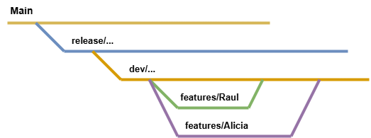

# Clonar / Remoto / Branchs para trabajar con un repositorio

Instrucciones para clonar,trabajar desde remoto, descargar, ramas (branch) y colaborar en el repositorio, así como cómo manejar conflictos al fusionar cambios.

---

# 🐑 Clonar el Repositorio con Git 

Para trabajar con el historial completo del repositorio y poder contribuir al proyecto, sigue estos pasos:

### 1. Clona el repositorio:
Ejecuta el siguiente comando en tu terminal para clonar el repositorio:

```bash
git clone https://github.com/...
```

### 2. Accede a la carpeta del proyecto:
Una vez clonado, ingresa a la carpeta del repositorio con:

```bash
cd Nombre_Carpeta
```

### 3. Actualiza el repositorio:
Para obtener los cambios más recientes desde el repositorio remoto, ejecuta:

```bash
git pull origin main
```

Nota: Si la rama principal del repositorio es `master` en lugar de `main`, usa el siguiente comando:

```bash
git pull origin master
```

---

## Descargar el Repositorio sin Clonarlo

Si solo necesitas descargar el código fuente sin el historial de Git, puedes hacerlo de las siguientes maneras:

### Usando `wget`:
1. Descarga el repositorio como un archivo ZIP:
   Ejemplo:

```bash
wget https://github.com/Laura250212/Practica/archive/refs/heads/main.zip
```

2. Extrae el archivo ZIP:

```bash
unzip main.zip
```

3. (Opcional) Elimina el archivo ZIP después de extraerlo:

```bash
rm main.zip
```

### Usando `curl`:
1. Descarga el repositorio como un archivo ZIP:

```bash
curl -L -o Practica.zip https://github.com/Laura250212/Practica/archive/refs/heads/main.zip
```

2. Extrae el archivo ZIP:

```bash
unzip Practica.zip
```

3. (Opcional) Elimina el archivo ZIP después de extraerlo:

```bash
rm Practica.zip
```

---

## Estructura del Repositorio

Una vez que hayas clonado o descargado el repositorio, encontrarás la siguiente estructura de carpetas y archivos:
Este es mi ejemplo:

```
Practica/
├── README.md          # Este archivo
├── src/               # Código fuente del proyecto
├── docs/              # Documentación del proyecto
└── ...                # Otros archivos y carpetas
```

---

# 🌍 Trabajar en Remoto sin Clonar

Esta guía explica cómo trabajar con repositorios Git de forma remota sin necesidad de clonar todo el historial, tanto desde la terminal como desde Visual Studio Code.

## Opciones desde Terminal

### Método 1: Git Archive

Este método te permite descargar una copia del repositorio sin el historial de Git:

```bash
git archive --remote=<URL-del-repositorio> HEAD | tar -x -C ./carpeta-destino
```

Ejemplo:
```bash
git archive --remote=https://github.com/usuario/repositorio.git HEAD | tar -x -C ./mi-proyecto
```

### Método 2: Descarga ZIP

Puedes descargar el repositorio como ZIP usando curl:

```bash
curl -L -o repositorio.zip https://github.com/usuario/repositorio/archive/refs/heads/main.zip
unzip repositorio.zip -d ./carpeta-destino
```

## Opciones desde Visual Studio Code

### 1. Extensión GitHub Repositories

1. Instala la extensión "GitHub Repositories"
2. Usa `Ctrl + Shift + P` (o `Cmd + Shift + P` en macOS)
3. Busca "GitHub: Open Remote Repository"
4. Ingresa la URL del repositorio

### 2. GitHub Codespaces

1. Ve al repositorio en GitHub
2. Haz clic en "Code" > "Open with Codespaces"
3. Trabaja directamente en el entorno de nube

## Limitaciones

- No hay acceso al historial de Git
- No se pueden gestionar ramas
- No se pueden hacer push al repositorio remoto directamente

## 🛠️ Alternativas para Colaboración

Si necesitas colaborar en el proyecto, considera estas opciones:

### Fork del Repositorio
```bash
git clone https://github.com/tu-usuario/repositorio-forkeado.git
```

### Trabajo con Ramas Remotas
```bash
git fetch origin nombre-de-la-rama
git checkout nombre-de-la-rama
```

### Interfaz Gráfica
Puedes usar GitHub Desktop para una experiencia más amigable.

---

# 🌿 Trabajar con Ramas (Branches) 

Git permite trabajar en ramas para desarrollar nuevas funcionalidades sin afectar el código principal. A continuación se explica cómo trabajar con ramas.

### 1. Crear una nueva rama:
Para crear una nueva rama y moverte a ella, usa el siguiente comando:

```bash
git checkout -b <nombre-de-la-rama>
```

Por ejemplo:

```bash
git checkout -b nueva-funcionalidad
```

### 2. Cambiar entre ramas:
Si ya tienes varias ramas y quieres cambiarte a una de ellas, usa:

```bash
git checkout <nombre-de-la-rama>
```

Por ejemplo, para cambiar a la rama `main`:

```bash
git checkout main
```

### 3. Ver las ramas disponibles:
Para ver todas las ramas disponibles en tu repositorio, usa:

```bash
git branch
```

Esto mostrará una lista de ramas, con un asterisco (*) junto a la rama en la que estás actualmente.

### 4. Fusionar ramas (Merge):
Cuando termines de trabajar en una rama y quieras integrar tus cambios en la rama principal (generalmente `main` o `master`), realiza un merge de la rama en la que estás trabajando a la rama principal.

1. Primero, cambia a la rama `main`:

```bash
git checkout main
```

2. Luego, haz el merge:

```bash
git merge <nombre-de-la-rama>
```

Por ejemplo, para fusionar la rama `nueva-funcionalidad`:

```bash
git merge nueva-funcionalidad
```

### 5. Subir cambios al repositorio remoto:
Una vez que hayas trabajado y realizado el merge de tus cambios en tu rama local, puedes subirlos al repositorio remoto con:

```bash
git push origin main
```



---

# 💻 Trabajar con Git en Visual Studio Code

Visual Studio Code es un editor muy popular que tiene integración directa con Git. Aquí te explico cómo trabajar con Git en VS Code:

### 1. Abrir el Proyecto:
Abre Visual Studio Code y selecciona **Abrir carpeta**. Luego selecciona la carpeta del repositorio clonado.

### 2. Verificar el Estado de los Archivos:
En el panel lateral izquierdo de VS Code, verás un icono de fuente de control (un icono de ramita 🌿). Haz clic en él para ver el estado de los archivos (si están modificados, agregados, etc.).

### 3. Hacer Commit:
- Después de realizar cambios en los archivos, verás esos archivos en la sección de cambios.
- Puedes seleccionar los archivos que deseas añadir al commit (o hacer clic en el símbolo de **+** junto al archivo para añadirlos).
- Luego, escribe un mensaje de commit en la caja superior y presiona el icono de **✔** para hacer commit.

### 4. Crear una Nueva Rama:
Para crear una nueva rama en VS Code, haz clic en la parte inferior izquierda donde aparece el nombre de la rama actual. Se abrirá un menú donde podrás elegir **Crear nueva rama**.

### 5. Cambiar de Rama:
De igual manera, puedes cambiar entre ramas haciendo clic en el nombre de la rama en la parte inferior izquierda y seleccionando la rama a la que deseas cambiar.

### 6. Hacer Pull y Push:
- Para **hacer pull** (obtener cambios del repositorio remoto), puedes usar el comando **Sincronizar cambios** (icono de nube con una flecha) en la parte inferior izquierda de la ventana.
- Para **hacer push** (subir tus cambios), VS Code lo hará automáticamente cuando hagas commit. Si no lo hace, puedes hacer clic en el icono de sincronización.

---

## Consejos para Evitar Conflictos

Si quieres entender mejor cómo manejar los conflictos de merge, puedes revisar el siguiente repositorio como referencia:

[Conflictos Merge - Mi otro repositorio](https://github.com/rsensomontojo/Conflictos_merge)

---
